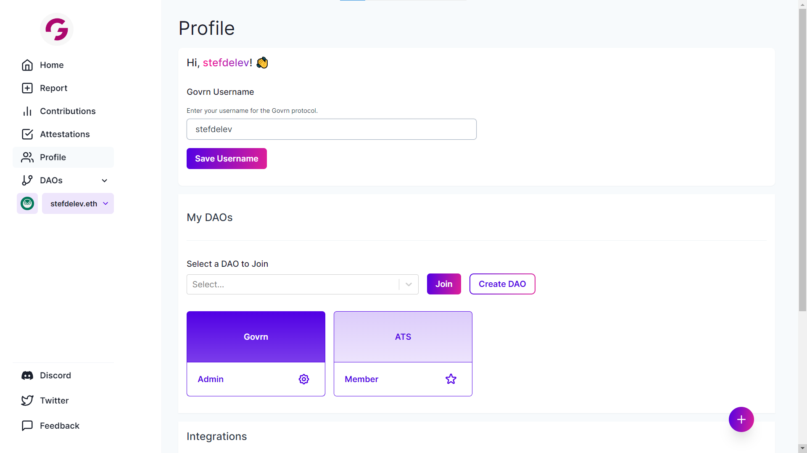

# 🎉 Create a DAO

<figure><figcaption>
Found under the <code>Profile</code> tab on the left panel
</figcaption></figure>

## How to Create a DAO?&#x20;

From the `Profile` tab, navigate to `Create DAO` button. As of now, we have one method but are introducing new methods very soon.&#x20;

### I. Manually add DAO member's wallet addresses

<figure><figcaption></figcaption></figure>

**Step 1**: After clicking on `Create a DAO`, you'll be navigated to this page. You'll need to name your DAO and include all members' wallet addresses. You can copy these from a CSV file and paste in the space below as long as they are valid addresses and are separated by commas.&#x20;

<figure><figcaption></figcaption></figure>

Once complete, hit `Import`. Then you're all set & ready to party!

**Step 2**: Find your newly set up DAO under the `Profile` tab.&#x20;

<figure><figcaption></figcaption></figure>

**To set DAO Admins, check out the  following page on **_**DAO Settings.**_

****
