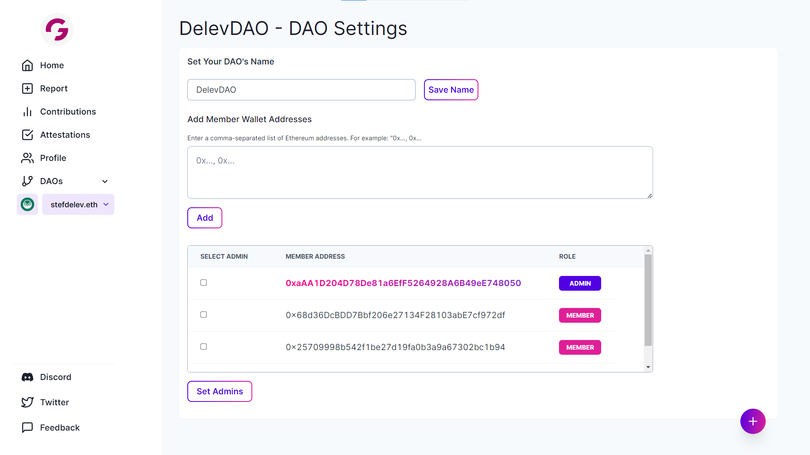

# ⚙ DAO Settings

### Set DAO Admins

Select the gear icon from the `Profile` page to open your DAO's Settings page&#x20;

<figure><figcaption></figcaption></figure>

<figure><figcaption></figcaption></figure>

From the `DAO Settings` page, you can add or edit members in addition to setting Admins.&#x20;
